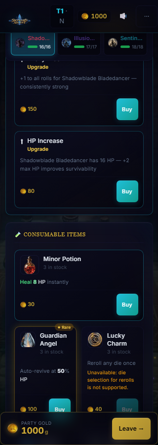
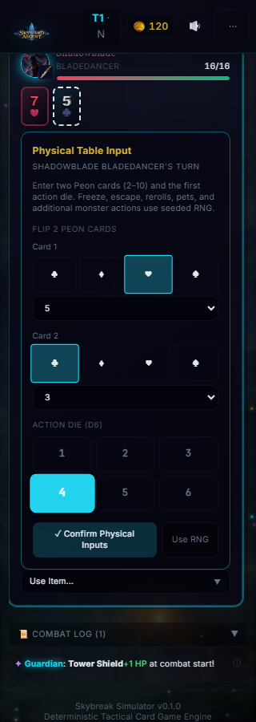

# Stage 2 evidence

The implementation and coverage boundaries are recorded in
[`STAGE2_REPORT.md`](../../STAGE2_REPORT.md) and
[`RULES_AUTHORITY.md`](../../RULES_AUTHORITY.md).

- [`content-coverage.json`](content-coverage.json): complete canonical class,
  specialization, monster, weapon, item, room, upgrade, service and enchantment
  inventory. Status strings distinguish execution smoke from effect certification.
- [`source-hashes.json`](source-hashes.json): SHA-256 digests for the delivered
  TypeScript/CSS, browser tests and package/test configuration.
- [`verification.json`](verification.json): command results, environment and
  deterministic smoke outcomes from the final validation.
- [`screenshots/`](screenshots/): real Chromium captures, including home/setup/
  combat at 320, 390, 768, 1280 and 1920px, narrow merchant/rest/tier/reports,
  reference/debug navigation, and representative current gameplay modes.

Representative mobile captures:

The full campaign unit fixtures use controlled damage to isolate navigation and
finalization. Report screenshots use controlled outcomes. Natural simulation
results and human-control browser interactions are separate forms of evidence;
none is presented as an exhaustive certification of all content mechanics.
